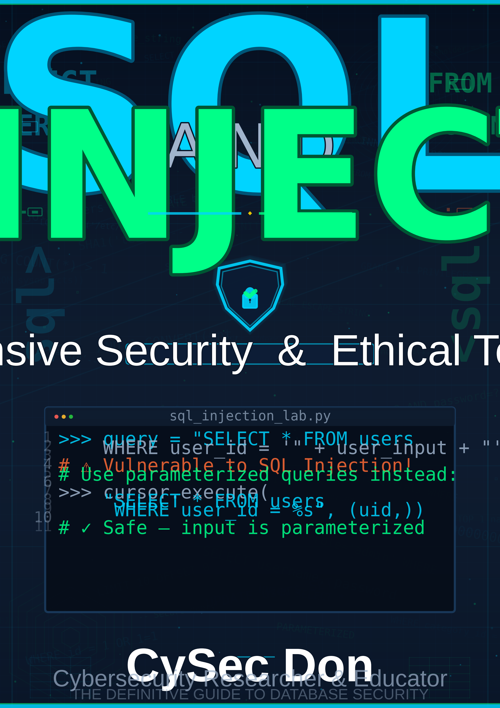

# SQL & SQL Injection: Defensive Security & Ethical Testing

<p align="center">
  
</p>

<p align="center">
  <strong>A comprehensive textbook and hands-on training lab for mastering SQL and SQL injection defense.</strong>
</p>

<p align="center">
  
  
  
  
</p>

---

## Overview

This repository contains two integrated components:

### 1. Professional Textbook (PDF)
A 27-page comprehensive textbook covering:
- **Part I-III:** Complete SQL education (DDL, DML, DCL, TCL, Advanced SQL)
- **Part IV-VI:** SQL Injection theory, types, detection, and testing
- **Part VII:** Prevention and defense strategies
- **Part VIII:** Hands-on lab exercises
- **Part IX-X:** Real-world case studies and assessments
- **Appendices:** Glossary, SQL Injection Cheatsheet

**[Download Textbook](SQL_and_SQL_Injection_Textbook_final.pdf)**

### 2. Hands-On Training Lab (Docker)
An intentionally vulnerable Flask web application with 8 progressive challenges covering every SQLi type from the textbook.

**[Jump to Lab](CySec_Lab/)**

---

## Quick Start — Lab

```bash
cd CySec_Lab
docker compose up -d --build
# Lab:     http://localhost:5000
# phpMyAdmin: http://localhost:8080
```

See [CySec_Lab/README.md](CySec_Lab/README.md) for full setup instructions.

---

## Lab Challenges

| # | Challenge | Category | Difficulty |
|---|-----------|----------|------------|
| 1 | Authentication Bypass | In-Band (Error-Based) | Beginner |
| 2 | Error-Based SQLi | In-Band (Error-Based) | Beginner |
| 3 | Union-Based SQLi | In-Band (Union-Based) | Intermediate |
| 4 | Boolean-Based Blind SQLi | Blind (Boolean) | Intermediate |
| 5 | Time-Based Blind SQLi | Blind (Time) | Advanced |
| 6 | Second-Order SQLi | Second-Order | Advanced |
| 7 | Full Data Extraction | In-Band (Union) | Advanced |
| 8 | Privilege Escalation | In-Band | Expert |

---

## Author

**CySec Don** — Cybersecurity Researcher & Educator
📧 cysecdon@gmail.com

---

## Legal & Ethical Notice

All materials in this repository are provided **exclusively for educational and authorized security testing purposes**. By using this software, you agree to:

1. Use it ONLY in environments you own or have explicit written authorization to test
2. Never use the techniques demonstrated against production systems without authorization
3. Comply with all applicable laws and regulations in your jurisdiction

Unauthorized access to computer systems is a criminal offense in most jurisdictions.

---

## License

Educational Use Only. Copyright CySec Don. All rights reserved.
